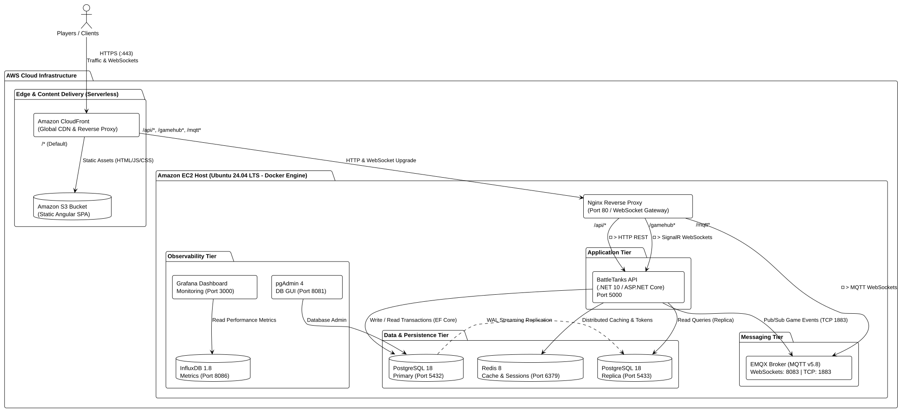

# BattleTanks

Real-time multiplayer tank battle game. Players register an account, create or join game rooms, and fight in a 2D tile-based arena. Built on a client-server architecture using HTTP REST for authentication and room management, SignalR for state synchronization, and MQTT (EMQX) for low-latency in-game event messaging.

---

## Cloud Architecture Overview

The production architecture deployed on **AWS** follows a decoupled and serverless-edge design for frontend delivery combined with containerized backend services on an **Amazon EC2** instance provisioned via **Terraform**.

### Architecture Diagram



> 📄 *The original PlantUML specification is available at [`docs/architecture.puml`](docs/architecture.puml).*

<details>
<summary><b>View Interactive Mermaid Diagram</b></summary>

```mermaid
flowchart TD
    subgraph Clients["👤 Players / Clients"]
        Browser["Web Browser / Client App"]
    end

    subgraph AWS["☁️ AWS Cloud Infrastructure"]
        
        subgraph Edge["Edge & Content Delivery (Serverless)"]
            CF["Amazon CloudFront\n(Global CDN & Reverse Proxy)"]
            S3[("Amazon S3 Bucket\n(Static Angular SPA)")]
        end

        subgraph EC2["Amazon EC2 Host (Ubuntu 24.04 LTS - Docker Engine)"]
            Nginx["Nginx Reverse Proxy\n(Port 80 / WebSocket Gateway)"]

            subgraph AppTier["Application Tier"]
                DotNetAPI["BattleTanks API\n(.NET 10 / ASP.NET Core :5000)"]
            end

            subgraph MsgTier["Messaging Tier"]
                EMQX["EMQX Broker (MQTT v5.8)\n(WS: 8083 | TCP: 1883)"]
            end

            subgraph DataTier["Data & Persistence Tier"]
                PG_Prim[("PostgreSQL 18\nPrimary (:5432)")]
                PG_Repl[("PostgreSQL 18\nReplica (:5433)")]
                Redis[("Redis 8\nSessions & Cache (:6379)")]
            end

            subgraph ObsTier["Observability Tier"]
                Influx[("InfluxDB 1.8\nMetrics (:8086)")]
                Grafana["Grafana Dashboard\nMonitoring (:3000)"]
                pgAdmin["pgAdmin 4\nDB GUI (:8081)"]
            end
        end
    end

    %% Client Traffic
    Browser -->|HTTPS :443| CF

    %% CloudFront Routing
    CF -->|"/* (Default)"| S3
    CF -->|"/api/*, /gamehub*, /mqtt*"| Nginx

    %% Nginx Routing
    Nginx -->|"/api/*" (REST)| DotNetAPI
    Nginx -->|"/gamehub*" (SignalR WS)| DotNetAPI
    Nginx -->|"/mqtt*" (MQTT WS)| EMQX

    %% Backend Integrations
    DotNetAPI -->|Write / Read (EF Core)| PG_Prim
    DotNetAPI -->|Read Queries| PG_Repl
    DotNetAPI -->|Distributed Cache| Redis
    DotNetAPI -->|Pub/Sub Events (TCP 1883)| EMQX

    %% Data Flow
    PG_Prim -.->|WAL Replication| PG_Repl
    Grafana --> Influx
    pgAdmin --> PG_Prim
```

</details>

---

## Tech Stack

| Layer | Technology | Version | Description |
| :--- | :--- | :--- | :--- |
| **Edge & CDN** | Amazon CloudFront + Amazon S3 | - | Global HTTPS delivery & single-domain reverse proxy |
| **Host Compute** | AWS EC2 (`t3.medium`) | Ubuntu 24.04 | Infrastructure & application container host |
| **API Gateway** | Nginx Alpine | Latest | WebSocket upgrade gateway & internal reverse proxy |
| **Backend Runtime** | .NET / ASP.NET Core | 10.0 | High-performance C# 13 REST API & SignalR Hub |
| **Frontend Framework** | Angular | 22.0 | SPA with NgRx Signals & TypeScript 6 |
| **Database** | PostgreSQL | 18 | Primary-replica architecture with streaming replication |
| **ORM** | Entity Framework Core (Npgsql) | 10.0 | Automatic code-first migrations on startup |
| **In-Memory Store** | Redis | 8 | Session cache, token blacklisting, and transient state |
| **Messaging Broker** | EMQX | 5.8 | High-throughput MQTT 5.0 broker with WebSocket support |
| **Monitoring & Metrics** | Grafana + InfluxDB | 11.4 / 1.8 | Real-time performance metrics and k6 benchmark logs |
| **Infrastructure as Code** | Terraform | >= 1.5 | Declarative AWS provisioning (EC2, S3, CloudFront, IAM) |

---

## Environments and Configuration Strategy

The application cleanly decouples **Local Development** from **Cloud Production** without code friction:

### 1. Frontend Environments (`Angular`)

* **Development (`src/environments/environment.ts`):**  
  Points directly to `http://localhost:5000/api` and `localhost:8083`. Used by default during `ng serve`.
* **Production (`src/environments/environment.prod.ts`):**  
  Uses **relative paths** (`/api`, `/gamehub`, and `wss://.../mqtt`). When built using `npm run build -- --configuration production`, Angular swaps `environment.ts` for `environment.prod.ts` via the `fileReplacements` rule in `angular.json`.  
  *Advantage:* Eliminates CORS restrictions and Mixed Content security errors by keeping all communication under the CloudFront HTTPS domain.

### 2. Backend Environments (`.NET 10`)

* **Local Run (`dotnet run`):**  
  Uses `launchSettings.json` with `ASPNETCORE_ENVIRONMENT=Development` and connects to `localhost`.
* **Production Docker Container:**  
  Docker Compose injects `ASPNETCORE_ENVIRONMENT=Production` and overrides connection strings using environment variables (`ConnectionStrings__PrimaryConnection=Host=postgres-primary;...`).  
  On startup, EF Core automatically applies any pending database migrations (`db.Database.Migrate()`).

---

## Deployment Guide

### Prerequisites

* Docker & Docker Compose v2+
* AWS CLI configured (`aws configure`)
* Terraform >= 1.5 installed
* Node.js 20+ and .NET SDK 10.0

---

### Step 1: Provision Cloud Infrastructure (Terraform)

All AWS cloud resources (EC2 instance, Security Groups, Elastic IP, S3 Bucket, and CloudFront distribution) are provisioned via Terraform:

```bash
cd terraform
terraform init
terraform plan
terraform apply
```

Upon completion, Terraform will output:

* `cloudfront_domain_name`: Your game's public HTTPS URL.
* `ec2_public_ip`: Static Elastic IP of the EC2 instance.
* `ec2_ssh_command`: Ready-to-use SSH connection string.

---

### Step 2: Deploy Frontend to CloudFront & S3

From the project root directory, run the automated deployment script:

```bash
./deploy-frontend.sh
```

This script:

1. Builds the Angular application in production mode (`ng build --configuration production`).
2. Syncs the compiled output to the private S3 bucket.
3. Invalidates the CloudFront cache to deploy updates globally.

---

### Step 3: Deploy Backend & Services on EC2

1. **Connect to your EC2 instance via SSH:**

   ```bash
   ssh -i ~/.ssh/ec2_keys ubuntu@<EC2_PUBLIC_IP>
   ```

2. **Clone the repository and start the containers:**

   ```bash
   git clone <REPO_URL>
   cd battle-tanks
   docker compose up -d --build
   ```

3. **Verify running services:**

   ```bash
   docker compose ps
   docker compose logs -f api
   ```

---

## Services and Ports Reference

| Service | Public / Routing URL | Internal Docker Port | Credentials |
| --- | --- | --- | --- |
| **Frontend Web Game** | `https://<CLOUDFRONT_DOMAIN>` | S3 / CloudFront | - |
| **Backend REST API** | `https://<CLOUDFRONT_DOMAIN>/api` | `api:5000` | - |
| **SignalR Realtime Hub** | `wss://<CLOUDFRONT_DOMAIN>/gamehub` | `api:5000` | JWT Token in Query String |
| **EMQX MQTT WebSockets** | `wss://<CLOUDFRONT_DOMAIN>/mqtt` | `emqx:8083` | - |
| **EMQX Dashboard** | `http://<EC2_IP>:18083` | `emqx:18083` | `admin` / `public` |
| **Grafana Monitoring** | `http://<EC2_IP>:3000` | `grafana:3000` | `admin` / `battletanks` |
| **pgAdmin Web GUI** | `http://<EC2_IP>:8081` | `pgadmin:80` | `admin@battletanks.com` / `admin` |
| **PostgreSQL Primary** | `localhost:5432` | `postgres-primary:5432` | `battletanks` / `battletanks` |

---

## Teardown Infrastructure

To destroy all provisioned AWS cloud resources and avoid ongoing charges:

```bash
cd terraform
terraform destroy
```

Type `yes` to confirm deletion.
